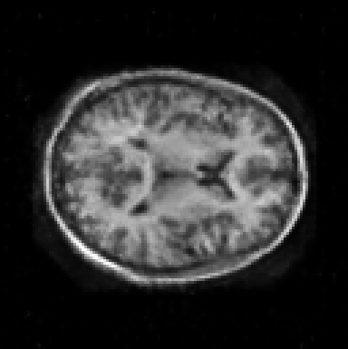
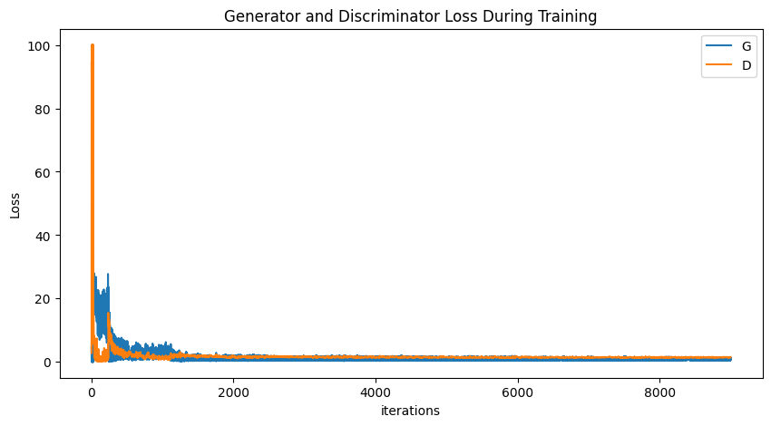
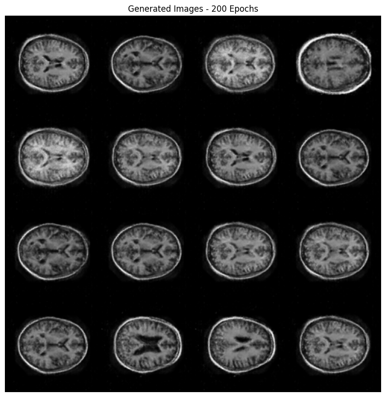
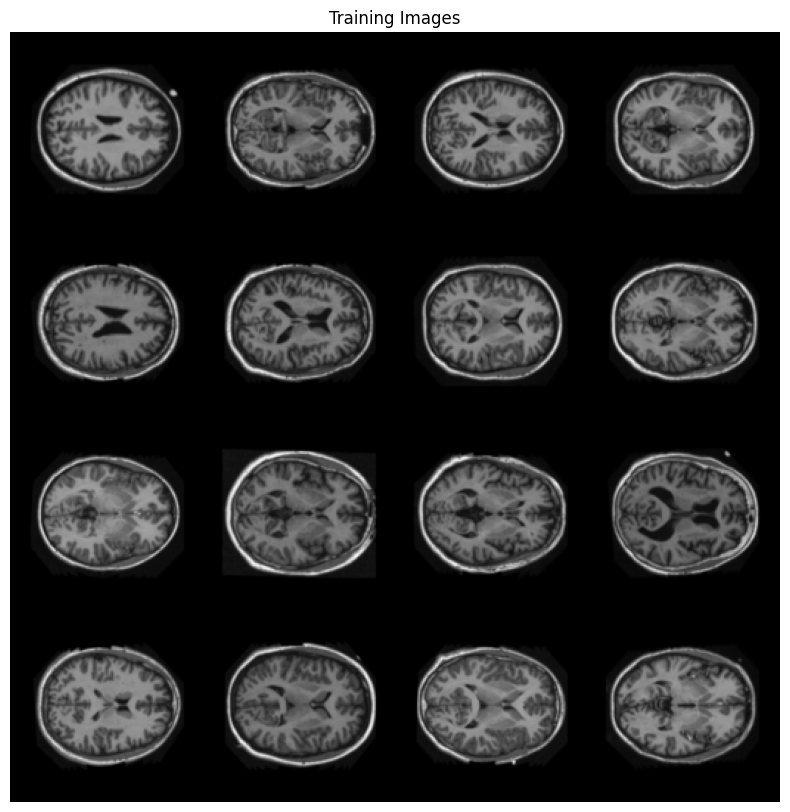
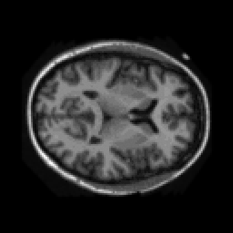
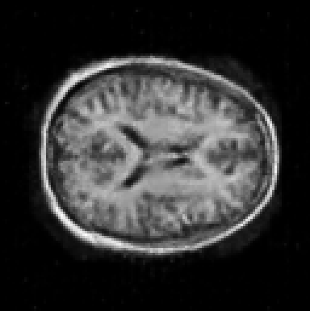
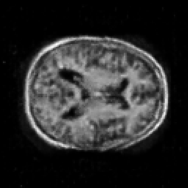
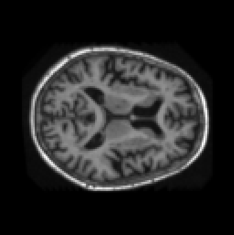

# Generative Adversarial Networks on the OASIS Dataset

The goal of this model is to generate realistic images of brain slices, similar
to an MRI using training data from the [Open Access Series of Imaging Studies
dataset](https://sites.wustl.edu/oasisbrains/) (OASIS). The model architecture
is based on a paper authored by Radford. A (2016) titled [Unsupervised
Representation Learning With Deep Convolutional Generative Adversarial
Networks](https://arxiv.org/pdf/1511.06434), which has become commonly known as
DCGAN. This model also used the [DCGAN
documentation](https://pytorch.org/tutorials/beginner/dcgan_faces_tutorial.html)
as boilerplate for creating the model but significant changes have been made in
terms of overall network structure and hyper-parameters in order to
successfully be applied to the OASIS dataset.

## Network Configuration

The discriminator and generator are both trained to accept or generate single
channel (greyscale) 128x128 images. The need to downscale the images from
256x256 was a necessary trade-off. The complexity of the model parameters
completely filled up the 40G of video memory the A100 graphics cards were
capable of so downsampling was necessary to maintain performance. 

### Important hyper parameters 
 - Epochs: 200
 - Learning Rate: 0.0002 (Generator), 2e-5 (Discriminator)
 - Optimiser: Adam
 - Loss function:  Binary Cross Entropy
 - Loss function:  Binary Cross Entropy
 - Layers: Six Convolution/Transpose layers each

## Training

Slices of output data for each of the first 20 epochs

Images became recognisable within the first 5 epochs. At 20 epochs, brains were
mostly indistinguishable to the training images although contained
noise. At epoch 100, noise became less prevalent and by epoch 200, finer
detail was being included in the generated images.

The loss plot of the training can be seen below

In hindsight, I would have log transformed the loss axis but the loss data was
unfortunately not saved.

## Results
Below are the generated images after 200 epochs of training. For reference, the training images are also shown to demonstrate their accuracy.

# Real or Fake?

